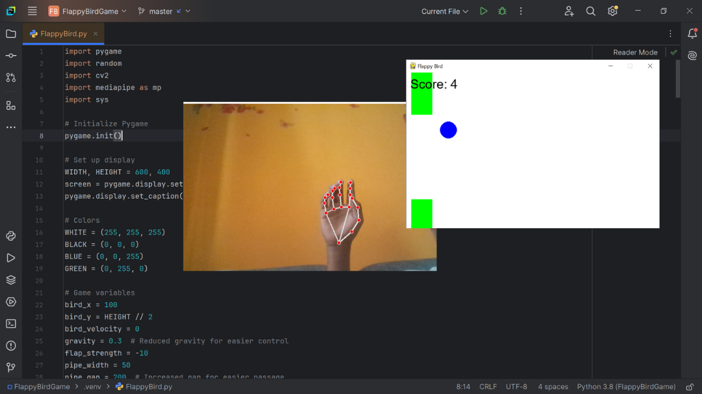

# Flappy Ball with Hand Gesture Control

This project implements a simple version of the classic Flappy Ball game using Pygame, where the player controls the Ball's movement with hand gestures. The game utilizes OpenCV and MediaPipe to track hand gestures, allowing players to "flap" the Ball by closing their fist.

## Features

- **Flappy Ball Gameplay**: The player controls the Ball by making a fist to flap and avoiding obstacles (pipes).
- **Hand Gesture Control**: The Ball flaps when the player makes a fist with their hand, using a webcam to track the hand.
- **Pipe Generation**: Pipes are randomly generated and move from right to left. The player must navigate the Ball through the gaps in the pipes.
- **Score System**: Points are earned for successfully passing through each set of pipes.
- **Game Over Screen**: The game ends when the Ball collides with a pipe or the ground. Players can restart the game or quit.

## Requirements

To run this game, you need to have the following libraries installed:

- **Pygame**: For game development.
- **OpenCV**: For accessing the webcam and handling video frames.
- **MediaPipe**: For hand tracking.

You can install the required libraries by running:

```bash
pip install pygame opencv-python mediapipe
```
# Setup

Clone this repository:

```bash
git clone https://github.com/your-username/flappy-Ball-hand-gesture.git
cd flappy-Ball-hand-gesture
```

The game will open in a window and use your webcam to track your hand gestures. To play:

- **Close your fist** to make the Ball flap and move upwards.
- The Ball will fall due to gravity if no gesture is detected.
- **Avoid colliding with pipes** by moving the Ball through the gaps.

## Controls

- **Fist Gesture**: Make a fist to make the Ball flap upwards.
- **'Space'**: Start the game.
- **'R'**: Restart the game after it ends.
- **'Q'**: Quit the game.

## Code Explanation

- **Main Game Loop**: The main game loop runs continuously, updating the Ball's position and checking for collisions with pipes. Hand gestures are detected using the webcam, and the Ball's velocity is adjusted accordingly.
- **Hand Gesture Detection**: The webcam feed is processed using OpenCV and MediaPipe to detect hand landmarks. If a fist gesture is detected (fingers curled towards the palm), the Ball flaps.
- **Collision Detection**: If the Ball collides with a pipe or the ground, the game ends, and a game over screen is displayed.
- **Pipe Movement**: Pipes move leftward and are recreated once they go off-screen to keep the game challenging.

## Screenshots

### Gameplay Screenshot:


## Troubleshooting

- **No webcam detected**: Ensure that your webcam is properly connected and accessible.
- **Hand gestures not detected**: Ensure good lighting and a clear view of your hands in the webcam frame.
- **Performance issues**: Lower the frame rate by adjusting the clock.tick() value in the main game loop if necessary.
